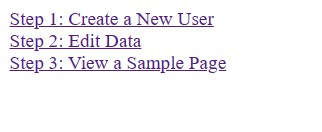

# CIS239-FinalProject

This project is an API based on seemingly deprecated Quote Garden API. The project is available on Github at this repository: 

## Example Output

When the index page loads, three links will appear walking you through the 3 steps of demonstrating the API.



## Analysis Steps

The assignment required an API to be created that requires a user to register their E-Mail address to receive their API key. The assignment also required an interface to edit API entries and a sample page that consumes the API and updates the DOM
to develop a solution.

### Design

Because the index page is the first page one will see, it will give links to each of the steps. The register page is where users register their E-Mail, provide a username that their entries default to and a password for security purposes. The editdata page displays every entry and provides EDIT links to their own entries and entries with Free Edit permissions. The login page is there those who are not logged in will input their username and password made on Step 1. The update page is where users update entries in the API. Only the original poster may change the Free Edit permissions. After updating, savechanges will save the changes made to the API

```
index.php
editdata.php
register.php
login.php
update.php
savechanges.php
```

### Testing

The testing process involved registering users and making the example entries.

This includes tesing Free Edit permissions

```
Free Edit Test
Vincent
EDIT
```

As well as updating said entries.

```
Quote Text: 
Changed to this

Author(if not you): 
(left blank to preserve author)

```

In order to confirm the API can work with most webpages, a year+ old page of mine was dug up and only the parts of the scripts.js file were edited to change the API from the old one to one made in this assignment.

## Notes

If you have XAMPP place the project files in the htdocs folder then navigate to where you placed the project files. If you are getting this from Github you may need to supply your own database.php and setup.sql files to create the database for this API.

## Do not change content below this line
## Adapted from a README Built With

* [Dropwizard](http://www.dropwizard.io/1.0.2/docs/) - The web framework used
* [Maven](https://maven.apache.org/) - Dependency Management
* [ROME](https://rometools.github.io/rome/) - Used to generate RSS Feeds

## Contributing

Please read [CONTRIBUTING.md](https://gist.github.com/PurpleBooth/b24679402957c63ec426) for details on our code of conduct, and the process for submitting pull requests to us.

## Versioning

We use [SemVer](http://semver.org/) for versioning. For the versions available, see the [tags on this repository](https://github.com/your/project/tags). 

## Authors

* **Billie Thompson** - *Initial work* - [PurpleBooth](https://github.com/PurpleBooth)

See also the list of [contributors](https://github.com/your/project/contributors) who participated in this project.

## License

This project is licensed under the MIT License - see the [LICENSE.md](LICENSE.md) file for details

## Acknowledgments

* Hat tip to anyone who's code was used
* Inspiration
* etc
